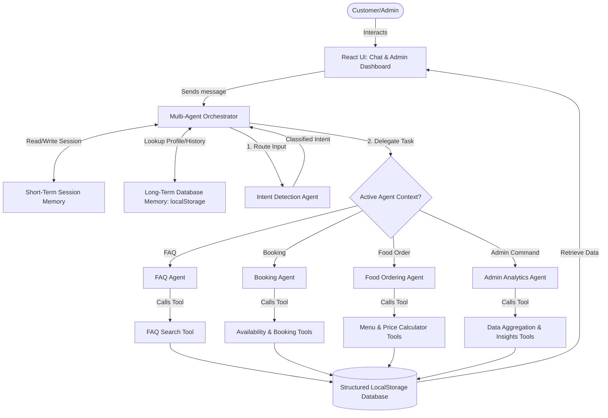

# DizinS AI - Hospitality Multi-Agent Automation System

**DizinS AI** is a production-ready, full-stack multi-agent automation platform designed for modern hotels and restaurants. It bridges the gap between client guest experiences and back-office hotel operations.

The system features:
1. **Interactive Customer Chat Portal** powered by an Orchestration routing layer. It guides guests through room bookings, food ordering, and FAQs, displaying step-by-step agent reasoning and tool executions.
2. **Executive Admin Operations Dashboard** displaying real-time metrics, interactive SVG graphs (revenue splits, booking trends), AI-generated operational warnings, and tables for checking in guests or preparing food orders.

---

## 🏗️ System Architecture



---

## 🛠️ Folder Structure

The project is structured modularly to separate the UI presentation layer, the data modeling/storage layers, and the AI agent execution engines:

```
/capston project/
├── package.json               # Dependencies and scripts (React, Vite, Lucide)
├── vite.config.js             # Vite development server settings
├── index.html                 # HTML Entry, loads Google Fonts (Outfit, Inter)
├── README.md                  # System documentation & workflows (This file)
└── src/
    ├── main.jsx               # React bootstrap mount script
    ├── App.jsx                # Root view router & main database-sync state
    ├── styles/
    │   └── index.css          # Design system, glassmorphism, & animations
    ├── data/
    │   ├── mockDatabase.js    # LocalStorage ORM interface (CRUD operations & seed generator)
    │   ├── faqDb.js           # FAQ structured knowledge base
    │   └── menuDb.js          # Restaurant & room service food menu details
    ├── agents/
    │   ├── tools.js           # Executable functions (cost calculators, searchers, database writers)
    │   ├── orchestrator.js    # Main router; handles context switches, interruptions, and logs
    │   ├── intentAgent.js     # Semantic intent classifier (detects context changes)
    │   ├── bookingAgent.js    # State machine for lodging parameters (collects & validates)
    │   ├── foodAgent.js       # Natural language cart builder & dining order collector
    │   ├── faqAgent.js        # Keyword-based FAQ search resolver
    │   └── analyticsAgent.js  # Chat-based business report generator
    └── components/
        ├── Sidebar.jsx        # Navigation panel (switch between chat, dashboard, logs)
        ├── ChatInterface.jsx  # Glowing chat interface + agent logs layout
        ├── AgentLogPanel.jsx  # Side debugger panel showing agent thoughts and JSON tools
        └── AdminDashboard.jsx # Analytics KPIs, SVG charts, active lists
```

---

## 🤖 Applied AI Agent Concepts

DizinS AI implements 5 key AI agent concepts:

1. **Multi-Agent Orchestration**: The `orchestrator.js` acts as a central hub. It evaluates incoming messages via the `Intent Detection Agent` first. If a user interrupts an active lodging flow to ask a quick FAQ, the orchestrator delegates to the `FAQ Agent`, prints the answer, and then resumes the lodging state.
2. **Context Engineering**: System templates and dialog histories are passed through the orchestrator. User inputs are parsed by agents to extract and validate specific entities (dates, names, room types).
3. **Long-Term Memory**: When a booking or order is completed, guest metadata (Name, Phone) is cached in the structured database. Future conversation sessions read this memory (from `localStorage`) to personalize greetings: *"Welcome back, Alice Smith! How can I help you today?"*
4. **Tool Calling**: Agents are equipped with simulated functional tools. Instead of guessing room prices or availability, the `Booking Agent` calls `checkRoomAvailability` and `calculateBookingCost` to execute deterministic math and query database tables.
5. **Reasoning & Task Routing**: Before acting, agents print their step-by-step reasoning ("Thoughts") showing their analysis (e.g. *"Reasoning: User requested standard room, but has not provided check-in date. I must prompt for check-in date next."*).

---

## 🚀 Setup & Launch Instructions

### Prerequisites
Make sure [Node.js](https://nodejs.org/) (v16+) is installed on your system.

### Installation
1. Extract or clone this directory.
2. Open your terminal in the directory.
3. Install dependencies:
   ```bash
   npm install
   ```
   *(Note: On Windows systems with PowerShell script execution restrictions, use `cmd /c "npm install"`)*

### Running Locally
To launch the Vite development server:
```bash
npm run dev
```
Open [http://localhost:5173](http://localhost:5173) in your browser.

### Building for Production
To compile and optimize the assets:
```bash
npm run build
```
The compiled files will be output to the `/dist` directory.

---

## 🌟 Demo Walkflows Explanation

To experience the full capabilities of DizinS AI, follow these demo steps:

### 1. The Room Booking Flow (Lodging Agent)
- **User input**: Select **"🏨 Book Room"** from the suggestion chips (or type *"I want to book a room"*).
- **Behavior**: The Intent Agent routes the message to the Booking Agent.
- **Variable Collection**: The agent will ask for your room type (Standard, Deluxe, Suite), Name, Phone, Check-in Date, Check-out Date, and Guest Count.
- **Validation**: Try typing an invalid checkout date (e.g. earlier than check-in) or an invalid guest count (e.g. `5`). The agent's secure validation layer will intercept the error and ask you to re-enter.
- **Tool Execution**: Once valid inputs are received, the agent triggers `checkRoomAvailability` and `calculateBookingCost` to output a reservation summary.
- **Database Write**: Reply **"Yes"** to confirm. The agent calls the `createBookingRecord` tool to write to `localStorage` and outputs a confirmation ID.

### 2. The Dining Order Flow (Food Agent)
- **User input**: Type *"Let's order some food"* or click **"🍔 Order Food"**.
- **NLP Cart Building**: The Food Agent prints the menu. Type *"I'd like 2 Margherita Pizzas and a Lava Cake"* or *"garlic shrimp and a craft beer"*.
- **Cart Summary**: The agent parses the quantity and names from your text, updates your cart, and displays the subtotal.
- **Delivery Details**: The agent collects your delivery location (e.g., room number or external address), name, and phone.
- **Validation & Tool Call**: The agent runs the `calculateFoodBill` tool to add a 10% tax and flat delivery fee, then asks you to confirm.
- **Confirm**: Confirm with **"Yes"** to register order in the database.

### 3. FAQ Interruption & Resumption (Orchestration)
- **Step 1**: Start a room booking by clicking **"🏨 Book Room"** and selecting **"Deluxe Room"**.
- **Step 2**: The agent asks for your name. Instead of answering with your name, interrupt the flow by asking: *"What time does the swimming pool open?"*.
- **Behavior**: The Orchestrator intercepts the FAQ intent, routes to the FAQ Agent, fetches the answer (Pool is open from 6:00 AM to 10:00 PM), prints it, and then resumes the booking state: *"🔄 Resuming Booking: Under what name should we place the room reservation?"*.
- **Impact**: Demonstrates advanced multi-agent dialog control.

### 4. Chat-Based Admin reports (Analytics Agent)
- **User input**: Type *"Show admin report summary"* or click the suggestion chip.
- **Behavior**: The Intent Agent detects the administrative keywords, routes to the Analytics Agent, which executes the `generateAnalyticsReport` tool.
- **Insights**: The agent aggregates database figures (Total bookings, revenue, food sales split) and outputs a corporate summary containing actionable recommendations.

### 5. Interactive Operations Dashboard (Business UI)
- **Step 1**: Go to the **Admin Dashboard** tab using the left sidebar.
- **Features**:
  - View real-time KPI metrics (Revenue, Occupancy).
  - Interact with custom dynamic SVG charts showing Room Bookings volume and Rooms-to-Food revenue percentage.
  - Review the **AI Business Recommendations** section for dynamic advice.
  - View the bookings and orders tables. Click **"Check In"** on a guest, or **"Deliver"** on a food ticket, and see the KPIs and Charts update in real-time.
- **Bypass**: Click **"System Logs"** in the sidebar to view the low-level agent actions and database transaction logs.
# DizinSAi

