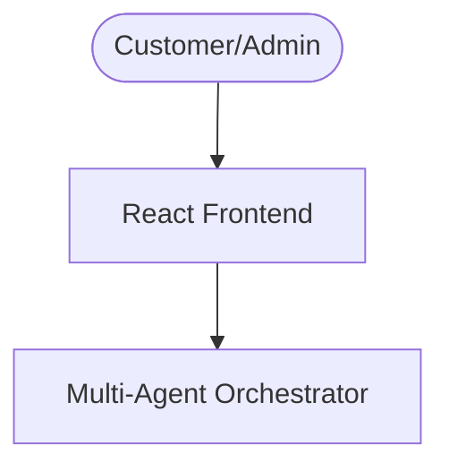

# 🚀 DizinS AI — Hospitality Multi-Agent Automation System

DizinS AI is a production-ready multi-agent automation platform built for modern hotels and restaurants. It improves customer experience while streamlining business operations through intelligent AI-driven workflows.

The platform automates:
- 🏨 Room booking
- 🍽️ Food ordering
- 💬 FAQ support
- 📊 Business analytics and operational monitoring

---

# 🌟 Overview

DizinS AI consists of two primary interfaces:

## 💬 Customer Chat Portal
An intelligent conversational interface where customers can:
- 🏨 Book rooms
- 🍔 Order food
- ❓ Ask business-related questions

The system displays real-time:
- 🧠 Agent reasoning
- 🔧 Tool execution
- 🔄 Context switching logs

## 📈 Executive Admin Dashboard
A real-time operations dashboard for administrators featuring:
- 💰 Revenue analytics
- 🏨 Occupancy tracking
- 📉 Booking trends
- 🍳 Kitchen order management
- 🤖 AI-powered business recommendations

---

# 🏗️ System Architecture



---

# 🤖 Core AI Agent Concepts

DizinS AI applies key agentic AI principles:

## 🔄 1. Multi-Agent Orchestration
A central orchestrator routes user requests to specialized agents:
- 🏨 Booking Agent
- 🍔 Food Agent
- ❓ FAQ Agent
- 📊 Analytics Agent

---

## 🧠 2. Context Engineering
Conversation context is preserved across multiple messages to ensure smooth interactions.

Example:
> Welcome back, Rishabh.

---

## 💾 3. Long-Term Memory
Customer information and conversation history are stored for personalized future interactions.

---

## 🔧 4. Tool Calling
Agents use specialized tools for:
- 🛏️ Room availability checks
- 💵 Price calculation
- 🧾 Order total calculation
- 📊 Analytics generation

---

## 🎯 5. Reasoning & Task Routing
Before responding, agents analyze:
- User intent
- Missing parameters
- Required tools
- Current workflow state

---

# ⚙️ Tech Stack

## 🎨 Frontend
- React
- Vite
- CSS
- Lucide Icons

## 🛠️ Backend Logic
- JavaScript Agent Engine
- Local Storage Database
- Modular Agent Architecture

---

# 📂 Project Structure

```bash
capston-project/
├── package.json
├── README.md
└── src/
```

---

# 🚀 Setup Instructions

## 📌 Prerequisites
Install Node.js (v16+)

[Node.js Download](https://reference-url-citation.invalid/0)

---

## 📥 Installation

Clone repository:

```bash
git clone <repository-url>
```

Install dependencies:

```bash
npm install
```

Run development server:

```bash
npm run dev
```

Open browser:

```bash
http://localhost:5173
```

---

# 🎬 Demo Workflows

## 🏨 Room Booking Flow
1. User requests room booking  
2. Booking Agent collects details  
3. Availability verified  
4. Booking confirmed  

---

## 🍔 Food Ordering Flow
1. User opens menu  
2. Food Agent parses selected items  
3. Bill calculated  
4. Order confirmed  

---

## ❓ FAQ Flow
The FAQ Agent answers:
- Check-in time
- Pool timings
- Services
- Pricing

---

## 📊 Admin Analytics Flow
Analytics Agent generates:
- Revenue summaries
- Booking reports
- Order statistics
- Business insights

---

# 💼 Business Impact

DizinS AI helps businesses by:

✅ Reducing manual workload  
✅ Improving response speed  
✅ Increasing booking efficiency  
✅ Enhancing customer satisfaction  
✅ Enabling data-driven decisions  

---

# 🔮 Future Improvements

Planned upgrades:

- 🎙️ Voice agent support
- 💳 Payment gateway
- ☁️ Cloud database
- 🧠 LLM-powered reasoning
- 📱 WhatsApp integration

---

# 👨‍💻 Author

**Rishabh Rai**  
🏆 Google × Kaggle Capstone Project  
🎯 Track 2 — Agents for Business
