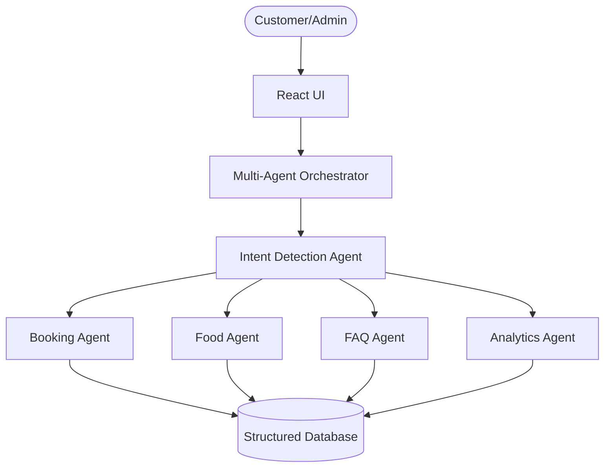

# 🚀 DizinS AI — Hospitality Multi-Agent Automation System

**DizinS AI** is a production-ready, full-stack **multi-agent automation platform** designed for modern hotels and restaurants.

Its goal is to improve customer experience while reducing manual workload for business owners by automating key hospitality operations using AI agents.

DizinS AI bridges the gap between **customer-facing interactions** and **back-office business operations**.

---

# ❗ Problem Statement

Hotels and restaurants often face several operational challenges:

- Delayed customer responses  
- Missed room bookings  
- Manual food order management  
- Repetitive customer queries  
- Poor operational visibility  
- Lack of analytics for decision-making  

These problems reduce customer satisfaction and increase staff workload.

---

# 💡 Solution

DizinS AI solves these challenges using an **agentic AI architecture**.

Instead of relying on a single chatbot, DizinS uses **multiple specialized AI agents**, where each agent handles a specific business workflow.

The platform automates:

- 🏨 Room booking
- 🍽️ Food ordering
- 💬 FAQ handling
- 📊 Business analytics
- 🧠 AI-powered operational recommendations

---

# 🌟 Core Platform Interfaces

DizinS AI provides two major interfaces.

---

## 💬 1. Customer Chat Portal

Customers interact with an AI concierge assistant through a modern chat interface.

Using the chat portal, users can:

- Book hotel rooms
- Order food
- Ask service-related questions
- Request admin support

The chat portal also displays:

- 🧠 Agent reasoning
- 🔧 Tool execution logs
- 🔄 Context switching behavior

This helps visualize how AI agents make decisions internally.

---

## 📈 2. Executive Admin Dashboard

The Admin Dashboard helps business owners monitor operations in real time.

It includes:

- 💰 Revenue analytics
- 🏨 Occupancy metrics
- 📉 Booking trends
- 🍳 Kitchen order monitoring
- 🤖 AI-generated business recommendations

This dashboard transforms raw operational data into actionable business insights.

---

# 🏗️ System Architecture

DizinS AI follows a **multi-agent orchestration architecture**.



---

# ⚙️ How The System Works

The complete workflow is as follows:

### Step 1 — User Interaction
A customer or admin sends a message through the UI.

Example:
- “I want to book a room”
- “Show menu”
- “What is check-in time?”

---

### Step 2 — Intent Detection
The **Intent Detection Agent** analyzes the user message and identifies the request type.

Possible intents:

- Room Booking
- Food Ordering
- FAQ Query
- Admin Report

---

### Step 3 — Task Routing
After intent classification, the **Orchestrator Agent** routes the request to the correct specialized AI agent.

Examples:
- Booking request → Booking Agent  
- Food request → Food Agent  
- FAQ → FAQ Agent  
- Business insights → Analytics Agent  

---

### Step 4 — Agent Processing
The selected agent collects missing information, performs reasoning, and executes required tools.

Example:
Booking Agent may ask:
- Name
- Check-in date
- Room type
- Number of guests

---

### Step 5 — Tool Execution
Agents use tools to perform deterministic tasks.

Examples:
- Check room availability
- Calculate booking cost
- Generate food bill
- Generate analytics report

---

### Step 6 — Final Response
The AI agent sends a structured response back to the user.

Example:
- Booking confirmation
- Order summary
- FAQ answer
- Business report

---

# 🤖 Core AI Agent Concepts

DizinS AI applies 5 major agentic AI concepts.

---

## 🔄 1. Multi-Agent Orchestration

A central orchestrator manages all agent workflows.

It coordinates:

- Booking Agent
- Food Agent
- FAQ Agent
- Analytics Agent

This creates a scalable modular architecture.

---

## 🧠 2. Context Engineering

The system preserves conversation context across multiple messages.

Example:

User starts booking → pauses → asks FAQ → resumes booking.

Context remains preserved.

This creates natural human-like conversations.

---

## 💾 3. Long-Term Memory

Customer data and previous interactions are stored for future use.

Stored information includes:

- Customer name
- Phone number
- Booking history
- Order history

Example:

> Welcome back, Rishabh.

This improves personalization.

---

## 🔧 4. Tool Calling

Agents use functional tools rather than guessing values.

Examples:

### Booking Tools
- Room availability checker
- Price calculator

### Food Tools
- Menu lookup
- Bill calculator

### Analytics Tools
- Revenue aggregation
- Occupancy analysis

This improves reliability and accuracy.

---

## 🎯 5. Reasoning & Task Routing

Before responding, agents analyze:

- User intent
- Missing parameters
- Required tools
- Current workflow state

This reasoning improves decision quality.

---

# 🧩 Specialized AI Agents

---

## 🏨 Booking Agent

Responsible for room reservations.

Collects:

- Guest name
- Phone number
- Room type
- Check-in date
- Check-out date
- Guest count

Responsibilities:
- Validate booking data
- Check availability
- Generate booking summary

---

## 🍽️ Food Ordering Agent

Responsible for restaurant and room-service orders.

Handles:

- Menu retrieval
- Cart building
- Quantity parsing
- Bill calculation
- Delivery details

Responsibilities:
- Parse natural language orders
- Calculate final cost
- Confirm order

---

## ❓ FAQ Agent

Handles common customer questions.

Examples:
- Check-in time
- Pool timings
- Wi-Fi availability
- Hotel services
- Pricing

Reduces repetitive manual support.

---

## 📊 Analytics Agent

Responsible for business intelligence.

Generates:

- Revenue reports
- Booking statistics
- Occupancy insights
- Operational recommendations

Helps management make data-driven decisions.

---

# 🛠️ Tech Stack

## Frontend
- React
- Vite
- CSS
- Lucide Icons

## Backend Logic
- JavaScript Agent Engine
- Local Storage Database
- Modular Agent Architecture

---

# 📂 Project Structure

```bash
capston-project/
│
├── package.json
├── README.md
├── vite.config.js
└── src/
    ├── agents/
    ├── components/
    ├── data/
    ├── styles/
    ├── App.jsx
    └── main.jsx
```

---

# 🚀 Setup Instructions

## Prerequisites
Install Node.js (v16+)

[Node.js Download](https://reference-url-citation.invalid/0)

---

## Installation

Clone repository:

```bash
git clone <repository-url>
```

Install dependencies:

```bash
npm install
```

Run project:

```bash
npm run dev
```

Open:

```bash
http://localhost:5173
```

---

# 🎬 Demo Workflows

## 🏨 Room Booking Flow
1. User requests room booking  
2. Booking Agent collects booking details  
3. Room availability verified  
4. Cost calculated  
5. Booking confirmed  

---

## 🍽️ Food Ordering Flow
1. User opens menu  
2. Food Agent parses selected items  
3. Quantity collected  
4. Final bill calculated  
5. Order confirmed  

---

## ❓ FAQ Flow
FAQ Agent answers common customer questions instantly.

---

## 📊 Admin Analytics Flow
Analytics Agent generates:
- Revenue reports
- Booking statistics
- Order insights
- Business recommendations

---

# 💼 Business Impact

DizinS AI helps hospitality businesses by:

✅ Reducing manual workload  
✅ Improving response speed  
✅ Increasing booking efficiency  
✅ Improving customer satisfaction  
✅ Enabling data-driven decision making  

---

# 🔮 Future Improvements

Planned upgrades:

- 🎙️ Voice AI support
- 💳 Payment integration
- ☁️ Cloud database
- 🧠 LLM-powered reasoning
- 📱 WhatsApp integration

---

# 👨‍💻 Author

**Rishabh Rai**  
🏆 Google × Kaggle Capstone Project  
🎯 Track 2 — Agents for Business
